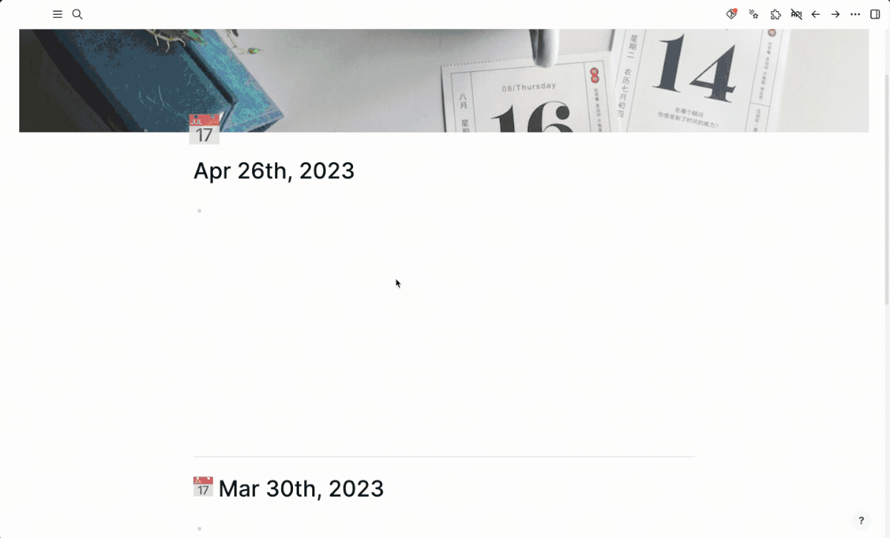
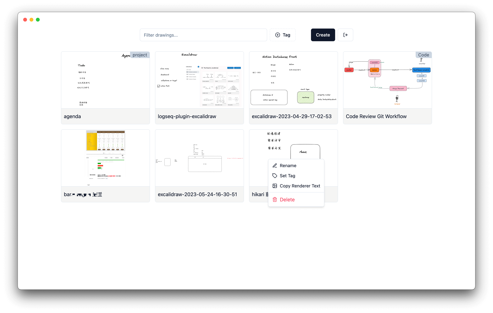
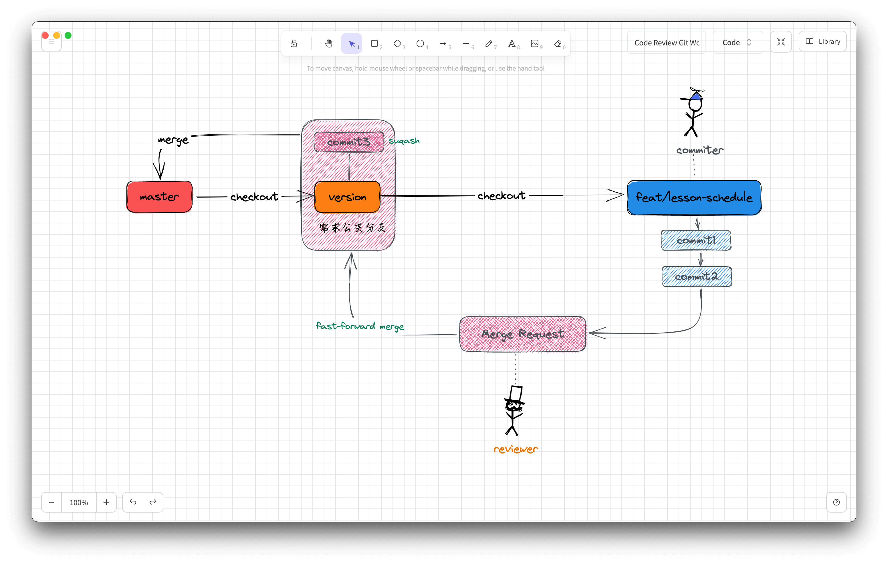
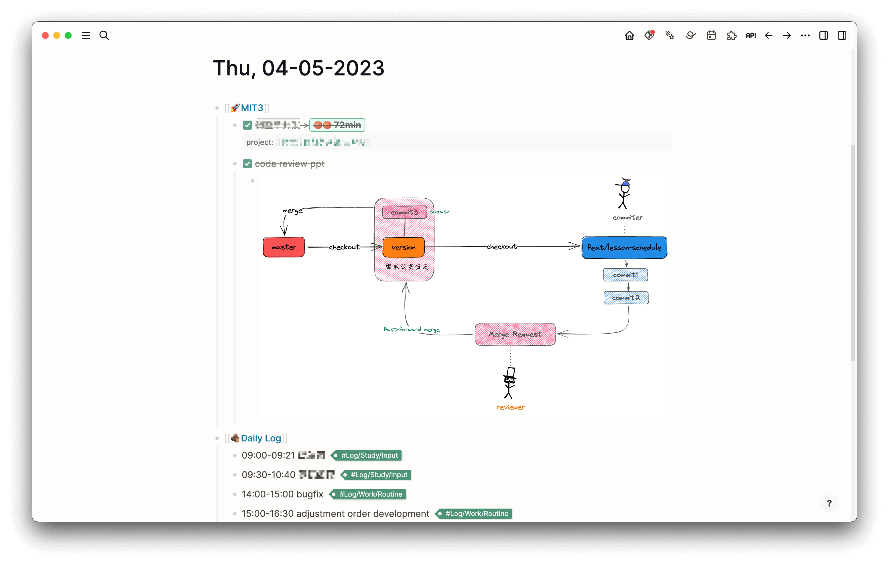

# logseq-plugin-excalidraw
> Logseq-plugin-excalidraw is a powerful and versatile plugin designed to seamlessly integrate Excalidraw into Logseq. With this plugin, you can effortlessly create and edit Excalidraw drawings within your Logseq.

## Demo

## Features

- Create and edit Excalidraw drawings directly in Logseq
- Import Excalidraw libraries for a more comprehensive drawing experience
- Easy-to-use interface for a smooth and efficient workflow
- Customizable font family

## Installation

1. Open Logseq and navigate to the plugins page.
2. Search for "Excalidraw".
3. Click "Install" to add the plugin to your Logseq.

## Usage

### Create a new drawing
Use `/` command, select "🎨 Excalidraw: Create New Drawing".

### Set font family
Fill in the font file address in the plugin settings.

- Online File: `https://example.com/your/path/font.woff2`
- Local File:
  - Mac: `file:///Users/foo/your/path/font.woff2`
  - Windows: `file:///C:/Users/foo/your/path/font.woff2`

## Notes

- Large files may cause freezing when saving, so it is recommended to save your work frequently and avoid working with excessively large files.
- Deleting an Excalidraw drawing within Logseq will also delete the original file.

## Why I made Excalidraw plugin
The reason for developing this plugin is that the excalidraw build-in with logseq cannot meet my needs, such as preview and full-screen operation.

I hope this plugin can help users easily showcase their ideas, so it needs to have the following features:

- full-screen operation
- support excalidraw library
- customize drawing name (in development)
- drawing management dashboard (in development)

Another point is that the plugin will remain synchronized with the official version of Excalidraw.

## Roadmap

- [x] image preview
- [x] full-screen operation
- [x] support excalidraw library
- [x] customize font family
- [x] customize drawing name
- [x] drawing management dashboard

## Screenshots

### Dashboard

### Editor

### Preview

## Contributing

We welcome contributions to improve and expand the functionality of logseq-plugin-excalidraw. If you have any suggestions or would like to contribute, please feel free to open an issue or submit a pull request on our GitHub repository.

## License

This project is licensed under the MIT License.